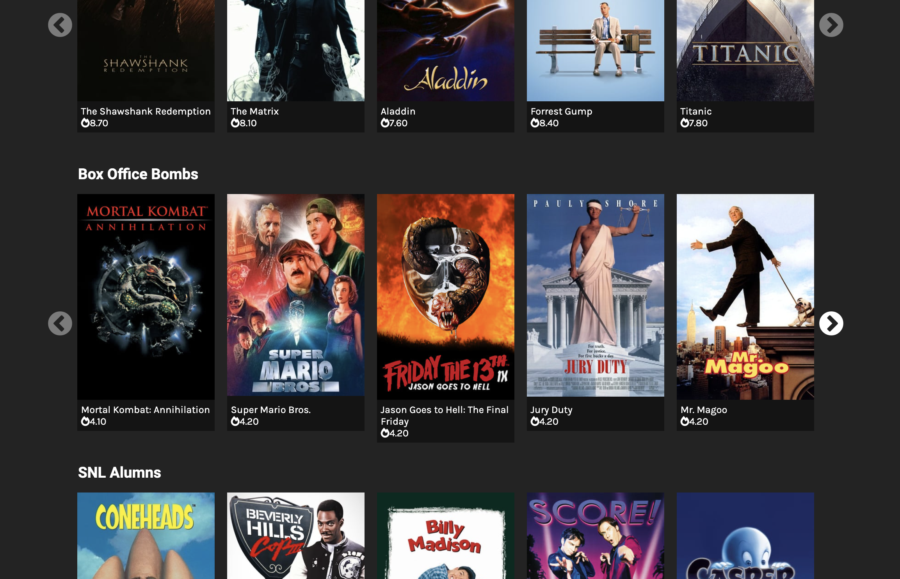

# 90s Movie Demo Site

This repo contains a Drupal site for teaching Views Custom Plugins. A reference database is included in this repo. This project uses lando to build the local environment so you can spin up a copy in minutes.

## Presentation

## Local Dev

### Requirements for local setup
- [Docker](https://www.docker.com/products/docker-desktop)
- [Lando](https://docs.lando.dev/basics/installation.html)

### Spinning up local env
- Clone this repository `https://github.com/nJim/movies.git movies`
- Start Docker and Lando `lando start`
- Download required packages `lando composer install`
- Import reference database `lando db-import database/database.sql.gz`
- View the local site: [http://movies.lndo.site](http://movies.lndo.site)

## Notable example views plugins

This repo includes a variety of examples Views Plugins to demonstrate what is possible with custom fields, filters, sorts and more. All custom plugins appear in the `movie_views` module. Some notable examples include:

- [Movie Poster Render](web/modules/custom/movie_views/src/Plugin/views/field/MoviePosterRendered.php): Uses the plugin render method to access the node object and build a render array. Includes custom filed options to alter the rendered objects.
- [Word Count Field](web/modules/custom/movie_views/src/Plugin/views/field/WordCountField.php): Employs a sql formula to calculate the number of words in a field. Also includes an example of performing this operation in the render method.
- [Movie Profit Field](web/modules/custom/movie_views/src/Plugin/views/field/MovieProfit.php): Example of using joins and formulas in a query to perform a calculation. Then uses simple PHP to control how the new field is rendered.
- [Excited Title Field](web/modules/custom/movie_views/src/Plugin/views/filter/ExcitedTitleFilter.php): Simple example of adding a where clause to the query.
